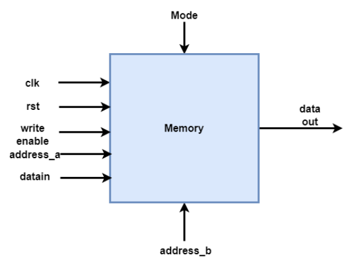

# Lab 4

1. Professor Calculas wants to construct a single port memory VEDA of dimension 32 × 32. This means that the depth of the memory is 32 and the width of the memory is 32 bits. A block diagram of this memory is shown in the figure. This memory operates into two different modes: scribble when mode=0 and interpret when mode=1. In scribble mode, the input data is written to the memory and driven on the data output. In interpret mode, the data previously written in the memory will be provided the output. In both the cases, the data will appear at the output port after one clock cycle delay of providing address value. Help professor Calculus to construct this memory by writing its Verilog code.

2. The next objective is to create a modified version of VEDA as shown in the figure. Here the memory has two different address ports addrss a and address b. The addrss a port is used to write in to the memory and addrss b is used to read from the memory. Write a Verilog code for this architecture. Note that addrss a and addrss b can not be of the same value.

